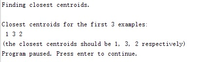

# 题目： K-Means 解题报告

本次作业为 `机器学习` 课程的第三次作业主要是和 K-Means 算法相关的课设和结题报告。

## 实现功能简介

在讨论具体的编码实现之中，我们可以对我们的程序文件进行逐个分析并简述功能和结果。在本部分之中我们会逐步分析 `ex3.m` 和 `ex3_pca.m` 两个文件中的各个 Part 去逐渐的完成这几个 Task 的功能，最终达到完成本次题目并且最终了解与 **K-Means** 和 **PCA** 相关知识的目的。

## 编写代码详述

### K-Means

K-Means 是一种向量化的均值算法，可以被简述为以下步骤：

- 分配(Assignment)：将每个观测分配到聚类中。

因为这一平方和就是平方后的欧氏距离，所以很直观地把观测分配到离它最近得均值点即可 。。


其中每个$X^p$都只被分配到一个确定的聚类中$S_t$，尽管在理论上它可能被分配到2个或者更多的聚类。

* 更新(Update)：计算得到上步得到聚类中每一聚类观测值的图心，作为新的均值点。


我们首先来分析 `ex3.m` 中的代码实现，来分析 K-Means 的具体实现：

``` matlab
%  To help you implement K-Means, we have divided the learning algorithm 
%  into two functions -- findClosestCentroids and computeCentroids.
```

程序中将 **K-Means** 算法分成了两个函数 **findClosestCentroids** 和 **computeCentroids** 函数，整个程序本身处于一个大的系统循环之中：


### Find Closest Centroids

``` matlab
% Find the closest centroids for the examples using the
% initial_centroids
idx = findClosestCentroids(X, initial_centroids);
```

我们在程序中调用 **findClosestCentroids.m** 文件，实现从给予的用例数据中，获取每个元素最近的中心。

对于每一个样例 $i$ ，计算其应该属于的类：
$$
c(i)  = j,min(||x^i −u_j||^2)
$$

``` matlab
for i=1:size(X,1)  
    adj = sqrt((X(i,:)-centroids(1,:))*(X(i,:)-centroids(1,:)));  
    idx(i)=1;  
    for j=2:K  
        temp=sqrt((X(i,:)-centroids(j,:))*(X(i,:)-centroids(j,:)));  
        if(temp<adj)  
            idx(i)=j;  
            adj=temp;  
        end  
    end 
end  
```

`centroids` 的输入是一个 **K** 个中心组成的特征向量，我们用变量 **idx** 记录离每个点最近的中心，这里我们的实现比较简单和暴力，这里我们通过一个简单的二次循环去比较找出最近的中心。



在这步中我们获得了如上的输出。

### Compute Means

``` matlab
%% ===================== Part 2: Compute Means =========================
%  After implementing the closest centroids function, you should now
%  complete the computeCentroids function.
%
fprintf('\nComputing centroids means.\n\n');

%  Compute means based on the closest centroids found in the previous part.
centroids = computeCentroids(X, idx, K);
```

接着我们来实现文本中的第二部分中的程序内容，在完成最近质心的计算之后需要完成质心的计算方法，我们调用 **computeCentroids** 部分的具体程序，并且传入了我们在上一步中计算出的一些计算结果：

``` matlab
for i=1:K
    list = find(idx==i);
    for j=1:size(list,1)
        centroids(i,:)=centroids(i,:)+X(list(j),:);
    end;
    centroids(i,:)=centroids(i,:)./size(list,1);
end;
```

 写成公式：

这里我们在里循环的每次迭代之后都计算了一个质点的均值，以便于在每次的迭代之后能更新出我们对应的质心的特征向量。

输出：


### K-Means Clustering

``` matlab
%% =================== Part 3: K-Means Clustering ======================
%  After you have completed the two functions computeCentroids and
%  findClosestCentroids, you have all the necessary pieces to run the
%  kMeans algorithm. In this part, you will run the K-Means algorithm on
%  the example dataset we have provided. 
%
```

在完成两个方法之后我们可以运行 **K-Means ** 算法了。


从这张图中我们能非常清晰的看出在10轮运算之中，质心在每一轮更新之后的状态。

### Principal components analysis  

**K-Means** 的优势十分明显，但是缺点也是令人一目了然的：

> * 聚类数目*k*是一个输入参数。选择不恰当的*k*值可能会导致糟糕的聚类结果。
> * 收敛到局部最优解，可能导致“反直观”的错误结果

K-Means 在引入大量数据的时候，可能会出现数据维度过高的情况出现，这种情况下，无论是分析我们的程序还是理解输出都为给我们造成很大的困扰。PCA 就是这样的一个用作 `降维` 的方法，PCA 不是一种经常使用的计算方法，因为降低维度本身是一种对数据的加工，如果我们没有对数据本身的清晰理解的话，贸然的进行数据降低纬度本身就是在破坏数据。

PCA 的步骤可以被简述为如下步骤：

* 通过预处理：

$$
X_{normalization} = \frac{X - mean(X)}{std(X)}
$$

* 计算协方差矩阵：

$$
\Sigma = \frac{1}{m}X^T*X
$$

* 矩阵的特征向量计算:

$$
[U,S,V] = svd(\Sigma)
$$

``` matlab
%% =============== Part 2: Principal Component Analysis ===============
%  You should now implement PCA, a dimension reduction technique. You
%  should complete the code in pca.m
%
```

按照要求和我们之前介绍的理论知识，我们在 `pca.m` 中添加这样的程序：

``` matlab
% 这里 PCA 使用的特征向量已经是进行过预处理
sigma = X' * X / m;     % 2:协方差
[U,S,V] = svd(sigma);   % 3:利用 Matlab 中 SVD 函数计算
```

这里的程序确实比较简单，只是在实现我们之前对 PCA 步骤的描述中公式的程序实现。


在图中我们清晰地看到了里面出现的特征向量的绘制，这就是所谓的主成分。

### Dimension Reduction

``` matlab
%% =================== Part 3: Dimension Reduction ===================
%  You should now implement the projection step to map the data onto the 
%  first k eigenvectors. The code will then plot the data in this reduced 
%  dimensional space.  This will show you what the data looks like when 
%  using only the corresponding eigenvectors to reconstruct it.
%
%  You should complete the code in projectData.m
```

S已经是有序的，自然U中列靠前的向量占有的信息较多，也就是返回原矩阵时，前面的列占有的权重较大，所以选择前K列的特征向量绘制在图中。

``` matlab
%  Project the data onto K = 1 dimension
K = 1;
Z = projectData(X_norm, U, K);
fprintf('Projection of the first example: %f\n', Z(1));
fprintf('\n(this value should be about 1.481274)\n\n');

X_rec  = recoverData(Z, U, K);
fprintf('Approximation of the first example: %f %f\n', X_rec(1, 1), X_rec(1, 2));
fprintf('\n(this value should be about  -1.047419 -1.047419)\n\n');
```

我们在 `projectData.m` 文件中实现了将矩阵降到K维，输入为X,U,K，输出为Z。

``` matlab
% Instructions: Compute the projection of the data using only the top K 
%               eigenvectors in U (first K columns). 
%               For the i-th example X(i,:), the projection on to the k-th 
%               eigenvector is given as follows:
%                    x = X(i, :)';
%                    projection_k = x' * U(:, k);
%
% 更新新维度下的 X 为 Z
Z = X * U(:,1:K); 
```


最后的输出图将上面拿到的主成分，降低纬度之后的特征向量，并且将他们用线连接了起来。

最后程序的输出为：


## 课程总结

这次的作业中是和 K-Means 算法有关系的内容，这方面的内容就我个人而言，是比较熟悉的，之前有做过一些自己写的小的分析图片的程序都用到了这样的算法。但是，当时的学习只是囫囵吞枣的学习让自己能写出来程序，并且借助了很多的高层次抽象的框架，并不是真正的了解算法的实际思想，但是这次在课堂上听过老师系统的讲解，我感觉自己对这些算法的理解和对数学意义的理解都能达到一个新的高度，感谢老师的讲解。

精彩而又有趣的机器学习课程落下了帷幕，短短几周的课程让我们感到受益匪浅，我们不但学习了很多有用的理论知识，而且还学到了很多 ML 进行实践操作的技巧，这令我非常的满足和高兴。获得了很多和机器学习相关的具体知识之外，我们从老师的课中还学到了很多科学的研究方法和学习方法。学到的这些研究和学习方法，会对我们之后无论是学习生活还是科研生活都有很多助益。

我前一段时间参加了一个在线的 Hackathon 活动，我们在几个小时中开发了一个基于 ML 的小程序，我们参照了一些前辈的 Demo 和思路，分析 MIDI 的文件格式，并且通过一些学习框架提供的神经网络学习的功能，实现了自动生产风格相近的 MIDI 电子乐的功能，做了一部分有趣的风格迁移。我们通过在有限的时间里阅读 MIDI 的格式说明，分析程序的曲调，选取简单 MIDI 音乐跑测试验证程序，借助 **Keras框架** 分解和生成音乐序列，再借助 **Music21** 程序库输出 MIDI 文件，我们这里面为了简单，直接只输出施坦威钢琴的曲子，这样在写音乐序列生成的过程中会有很多的便利。**Keras ** 框架本身基于 Tensorflow 框架，但是提供了简单易用的 API 和实现方式，我们读过文档之后就能试着使用了。但是使用高层次框架知识一种实现方式，而不是最终目的，我在课堂上学到的很多的基础算法也起到了非常重要的作用我们借助这些基础算法，才能理解并且正确使用高层次的 API。

这种将知识直接化为应用的案例，让我感到非常开心，这也体现出了我们这个仍处于发现时代的优势。一种技术从实验室走向产品线，再从商业的成功应用反哺到课堂之中，让我们能自己用在实际开发之中，这整个过程速度都非常快。机器学习的课程给了我们一个了解这些技术的入门方式，之后我还会继续学习和了解这方面的知识，了解更多和 Machine Learning 相关的知识，开发更多相关的应用。